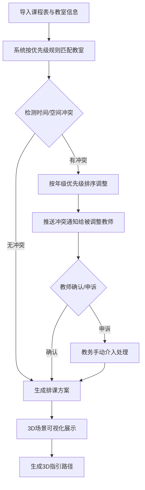
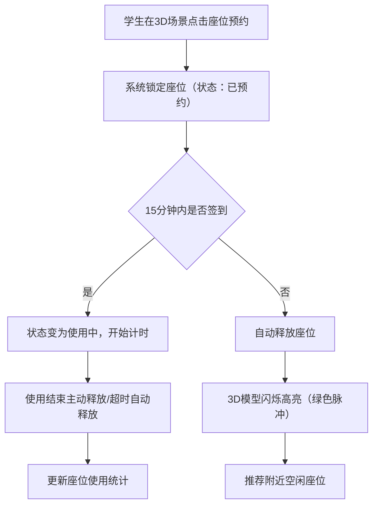
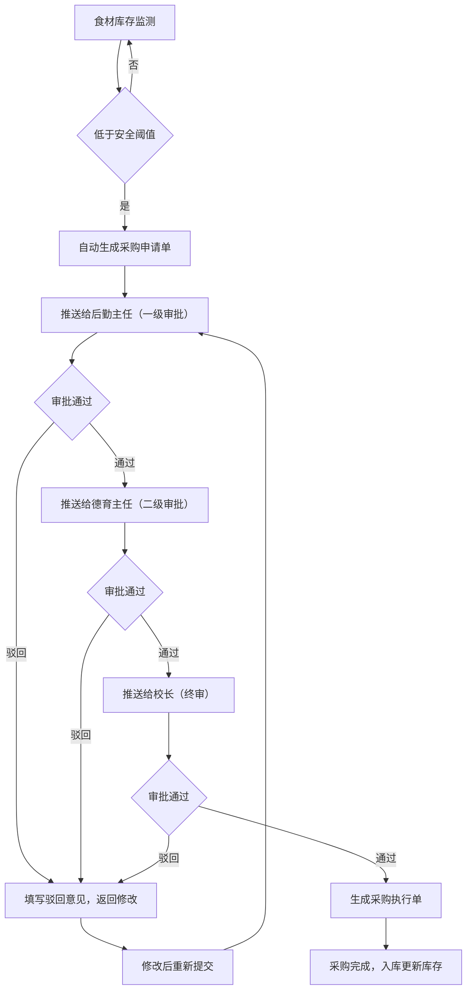
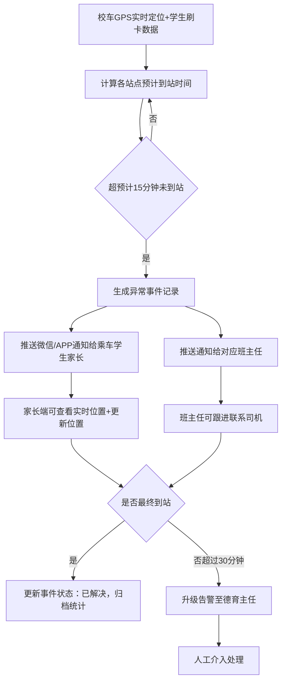
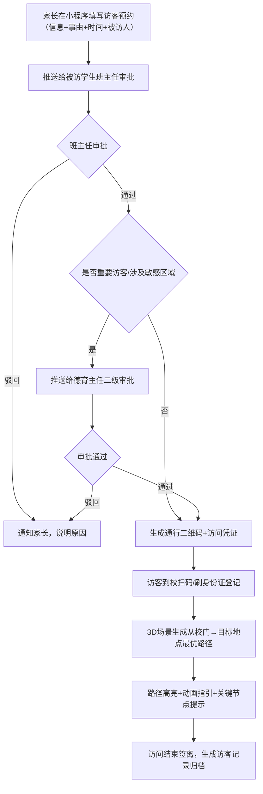

## 1. 产品概述

面向城市中小学的3D交互可视化教务调度与安全管理综合平台，通过三维建模技术直观呈现校园物理空间，实现教室智能分配、图书馆座位预约、食堂库存管理、校车安全监控、访客审批及设备运维的全链路数字化管理。平台以"可视、可管、可控、可溯"为核心目标，全面提升校园运营效率与安全保障水平。

- **目标用户**：校长、德育主任、后勤主任、班主任、教师、学生、家长
- **核心价值**：三维可视化决策支持、智能调度优化资源配置、多级审批确保安全合规、全维度数据驱动运营

## 2. 核心功能

### 2.1 用户角色与权限体系

| 角色 | 注册/登录方式 | 核心权限 |
|------|--------------|---------|
| 学生 | 人脸识别/学号登录 | 查看个人课表、图书馆座位预约、校车查询、查看食堂菜单 |
| 教师 | 人脸识别/工号登录 | 查看课表、教室使用申请、设备报修、查看班级出勤 |
| 班主任 | 人脸识别/工号登录 | 班级管理审批、学生出勤统计、家长访客审批、查看班级数据 |
| 后勤主任 | 人脸识别/工号登录 | 食堂采购审批（一级）、设备工单分派、库存管理、运维统计 |
| 德育主任 | 人脸识别/工号登录 | 采购审批（二级）、访客审批、应急事件处理、学生处分管理 |
| 校长 | 人脸识别/工号登录 | 采购终审（三级）、全局数据看板、运营日报查看、重大决策审批 |
| 家长 | 手机号预约 | 访客预约、子女校车位置查看、出勤通知接收 |

### 2.2 功能模块清单

1. **登录认证中心**：人脸识别登录、操作日志记录、权限校验
2. **总控中心驾驶舱**：全局3D校园概览、实时数据仪表盘、告警中心、快捷操作
3. **教学楼与教室管理**：3D楼层导航、教室智能分配、冲突自动调整、环境传感器监控
4. **图书馆管理**：座位预约系统、超时自动释放、3D空座高亮、借阅统计
5. **食堂管理**：菜品营养成分展示、实时库存监控、采购申请自动生成、三级审批流程
6. **校车管理**：实时位置追踪、学生刷卡签到、异常到站通知、乘车记录
7. **访客管理系统**：线上预约申请、审批流程、3D路径指引、访客记录
8. **设备运维中心**：故障自动告警、维修工单生成、工单流转追踪、设备台账
9. **数据导出中心**：运营日报Excel导出、出勤率统计、资源消耗分析、事件统计

### 2.3 页面详细说明

| 页面名称 | 模块名称 | 功能描述 |
|---------|---------|---------|
| 登录页 | 人脸识别面板 | 摄像头采集人脸、识别验证、登录日志记录 |
| 登录页 | 账号密码登录 | 学号/工号+密码登录、角色选择 |
| 总控中心 | 3D校园全景 | 可旋转缩放的校园模型、各楼栋状态指示、点击进入场景 |
| 总控中心 | 实时数据看板 | 今日出勤人数、教室使用率、食堂就餐人数、在线校车数、待处理工单 |
| 总控中心 | 告警中心 | 设备故障告警、校车异常、库存预警、审批待办提醒 |
| 教学楼场景 | 3D楼层模型 | 多层教学楼结构、教室位置标注、房间编号显示 |
| 教学楼场景 | 教室信息面板 | 课程名称、任课教师、座位占用率、实时温湿度/照度数据 |
| 教学楼场景 | 智能排课分配 | 根据课程表+容量自动匹配教室、冲突检测、年级优先级调整规则 |
| 教学楼场景 | 3D路径指引 | 从当前位置到目标教室的最优路径可视化、高亮指引 |
| 教学楼场景 | 冲突处理 | 教室冲突自动升级通知、按优先级（高三>高二>高一>初三...）调整、推送通知给相关教师 |
| 图书馆场景 | 3D座位布局 | 阅览区座位模型、实时占用状态颜色区分（绿=空闲/黄=已预约/红=使用中） |
| 图书馆场景 | 在线预约 | 选择座位+时间段预约、签到功能、15分钟超时自动释放 |
| 图书馆场景 | 空座高亮 | 释放后座位3D闪烁高亮、推荐就近空闲座位 |
| 食堂场景 | 窗口菜品展示 | 3D餐台模型、每道菜名称/营养成分（热量/蛋白质/脂肪/碳水）/价格 |
| 食堂场景 | 实时库存监控 | 食材库存仪表盘、库存低于安全阈值标红预警 |
| 食堂场景 | 自动采购申请 | 阈值触发自动生成采购单、推送到审批流 |
| 食堂场景 | 三级审批流程 | 后勤主任→德育主任→校长逐级审批、审批意见记录、驳回重提 |
| 校车场景 | 3D校车模型 | 车辆外观+内部座位布局、编号标识、座位占用状态 |
| 校车场景 | 实时位置地图 | GPS定位轨迹、预计到站时间、线路显示 |
| 校车场景 | 学生刷卡签到 | 上车刷卡记录、乘车名单、未上车学生提醒 |
| 校车场景 | 异常通知 | 超15分钟未到站自动推送家长通知、生成异常事件记录 |
| 访客管理 | 预约申请 | 家长填写访客信息（姓名/身份证/事由/被访人/访问时间） |
| 访客管理 | 审批流程 | 班主任/德育主任审批、审批通过生成二维码凭证 |
| 访客管理 | 3D路径指引 | 校门→目标办公室/教室的三维路径、重要节点标注 |
| 设备运维 | 故障上报 | 教师/学生在3D场景点击设备报修、填写故障描述 |
| 设备运维 | 自动工单生成 | 故障告警触发工单、自动分派对应维修组 |
| 设备运维 | 工单追踪 | 待分派/处理中/已完成状态流转、维修记录、评价反馈 |
| 数据导出 | 运营日报 | 选择日期生成Excel、包含出勤/食堂/设备/事件四大模块统计 |
| 数据导出 | 报表预览 | 在线预览数据图表、一键下载Excel文件 |
| 操作日志 | 日志查询 | 按用户/时间/操作类型查询、登录/审批/修改等关键操作留痕 |

## 3. 核心流程

### 3.1 教室智能分配与冲突处理流程
学期初导入课程表→系统按年级优先级+教室容量+设备需求匹配→生成初始分配方案→检测时间冲突→按优先级规则（高年级优先）自动调整→推送调整通知给相关教师→确认后在3D场景显示→生成教室使用日历

### 3.2 图书馆座位预约与超时释放流程
学生选择座位预约→系统锁定座位15分钟→到达现场扫码签到→座位状态变为使用中→使用结束离开释放→超时15分钟未签到→系统自动释放→3D高亮闪烁提示→推荐附近空座

### 3.3 食堂采购三级审批流程
库存低于安全阈值→自动生成采购申请单→后勤主任一级审批→德育主任二级审批→校长终审→通过后交采购执行→采购完成入库更新→驳回则返回修改重提

### 3.4 校车异常通知流程
校车GPS实时上报位置→站点停留+学生刷卡记录→系统计算预计到站时间→超15分钟未到→自动生成异常记录→推送通知给家长+班主任→家长可查看实时位置→到校后更新状态→异常事件归档统计

### 3.5 访客预约与3D指引流程
家长线上填写访客申请→班主任审批→德育主任审批（重要访客）→审批通过生成二维码→访客到校扫码登记→系统生成3D路径（校门→目的地）→语音+动画指引→访问结束签离→访客记录归档

## 4. 用户界面设计

### 4.1 设计风格

**整体风格**：科技感未来主义 × 教育温暖感
- **主色调**：深邃科技蓝 `#0A2463`（信任与专业）作为品牌主色
- **辅助色**：活力教育黄 `#FCA311`（警示与提示）、安全绿 `#2EC4B6`（正常状态）、警示红 `#E63946`（告警状态）
- **中性色**：近黑 `#0D1117`（3D场景背景）、深灰 `#161B22`（面板底色）、中灰 `#30363D`（边框分隔）、浅灰 `#8B949E`（次要文字）、纯白 `#F0F6FC`（主要文字）

**视觉元素**：
- 按钮风格：微渐变圆角矩形（8px）、hover时发光边框、active时轻微凹陷
- 字体：标题使用 `Orbitron`（未来科技感），正文使用 `Noto Sans SC`（中文清晰易读）
- 布局：左侧导航栏（可折叠）+ 中央3D主场景 + 右侧信息面板（可抽屉式展开）
- 图标风格：Lucide Linear 线性图标 + 状态点彩色指示
- 3D模型风格：低多边形（Low Poly）+ PBR材质 + 轮廓线描边（选中时）

### 4.2 页面设计概览

| 页面名称 | 模块名称 | UI设计细节 |
|---------|---------|-----------|
| 登录页 | 人脸识别面板 | 半透明玻璃拟态卡片、摄像头圆形取景框、扫描线动画、识别进度百分比、底部涟漪动效 |
| 登录页 | 背景氛围 | 动态3D校园线框模型缓慢旋转背景、粒子漂浮效果、渐变光晕 |
| 总控中心 | 左侧导航 | 折叠式图标导航、激活项高亮黄条、徽章显示待办数量、底部当前用户信息卡 |
| 总控中心 | 中央3D场景 | 全屏校园3D模型、鼠标拖拽旋转/滚轮缩放/点击楼栋、无人机视角切换按钮、楼层剖切 |
| 总控中心 | 顶部数据条 | 今日关键指标卡片（出勤/教室/食堂/校车/工单）、数字滚动动画、趋势小箭头 |
| 总控中心 | 右侧告警面板 | 时间倒序告警列表、优先级颜色标签（红/黄/蓝）、一键处理按钮、展开查看详情 |
| 教学楼场景 | 3D楼层 | 点击楼层高亮、教室悬浮信息卡片（课程+占用率+环境指标）、门禁状态指示 |
| 教学楼场景 | 分配方案表 | 甘特图式课表、时间轴拖动、冲突位置红色闪烁、拖拽手动调整 |
| 教学楼场景 | 路径指引 | 地面发光导航线、拐点箭头动画、距离/预计时间浮窗、语音播报开关 |
| 图书馆场景 | 3D座位 | 不同状态颜色（绿/黄/红）、点击弹出预约面板、释放时绿色脉冲扩散动画 |
| 图书馆场景 | 预约面板 | 时间段选择器、座位信息、签到二维码、倒计时显示 |
| 食堂场景 | 餐台模型 | 悬浮菜品卡片（名称+营养环+价格）、库存进度条、低库存红色脉动 |
| 食堂场景 | 审批流 | 审批节点流程图、当前节点高亮、审批意见输入框、电子签名区域 |
| 校车场景 | 地图+3D | 左侧2D地图轨迹、右侧3D校车模型切换、座位占用热力图 |
| 校车场景 | 异常通知 | 红色弹窗告警、家长联系方式快捷拨打、异常详情编辑 |
| 访客管理 | 预约表单 | 卡片式分步表单、证件OCR识别辅助填充、时间轴进度指示 |
| 访客管理 | 3D指引 | 第一人称视角路径漫游、关键地点（保安亭/楼梯/办公室）标注、方向指引箭头 |
| 设备运维 | 3D设备点 | 设备位置标注红点、点击弹出故障详情、维修人员头像状态、完成后变绿勾 |
| 设备运维 | 工单看板 | 拖拽式看板（待分派/处理中/待验收/已完成）、工单卡片含优先级标签 |
| 数据导出 | 报表生成 | 日期范围选择器、统计卡片、Excel图标、生成进度条、下载按钮 |
| 操作日志 | 日志列表 | 筛选条件栏、时间轴日志条目、用户头像+操作类型图标、详情弹窗 |

### 4.3 响应式设计

- **桌面端优先**（1920×1080及以上）：完整3D场景+左右侧面板全开
- **平板适配**（1024-1919）：右侧面板改为底部抽屉、左侧导航折叠为图标
- **移动端查看**（768-1023）：3D场景简化为2D拓扑图+关键指标卡片、功能按角色裁剪

### 4.4 3D场景指导

**环境与氛围**：
- HDRI：使用室内柔和办公室环境贴图，避免强烈反射干扰信息读取
- 背景色：`#0D1117` 深空蓝灰，营造科技感深色主题
- 雾效：`FogExp2` 指数雾，远处建筑渐隐，增强空间纵深感

**光照设置**：
- 主光：方向光模拟日光，色温5500K，强度0.8，投射软阴影
- 补光：半球光（天顶蓝/地面暖灰），强度0.4，消除暗部死黑
- 点光源：教室内嵌入式顶灯，对应真实位置，开启阴影，营造室内氛围

**摄像机与运动**：
- 默认视角：45°鸟瞰俯视，全校场景尽收眼底
- 交互：`OrbitControls` 拖拽旋转、右键平移、滚轮缩放、阻尼缓动
- 切换：点击楼栋→相机动画平滑飞入（Tween.js），带淡入淡出过场

**构图与焦点元素**：
- 中央为教学楼群，周围环绕图书馆/食堂/操场/校车停车场
- 选中楼栋时其余建筑半透明淡化（opacity=0.3），突出主体
- 关键信息以Sprite悬浮标签形式存在，始终面向摄像机

**交互与动画**：
- 悬停：物体外发光（outline post-processing），颜色按状态区分
- 选中：线框+辉光+信息卡片从下方滑入动画
- 状态变化：颜色过渡动画（0.3s）+ 粒子脉冲效果
- 路径指引：纹理流动的TubeGeometry管道，沿路径方向发光纹理滚动

**后处理效果**：
- Bloom泛光：阈值0.8，强度0.5，使发光元素有辉光效果
- FXAA抗锯齿：平衡性能与画质
- Vignette暗角：增强沉浸感

**性能预算**：
- 总面数控制在15万面以内（楼栋使用实例化几何体）
- 贴图总大小不超过20MB（使用KTX2压缩纹理）
- 目标帧率：桌面60fps，移动端30fps
