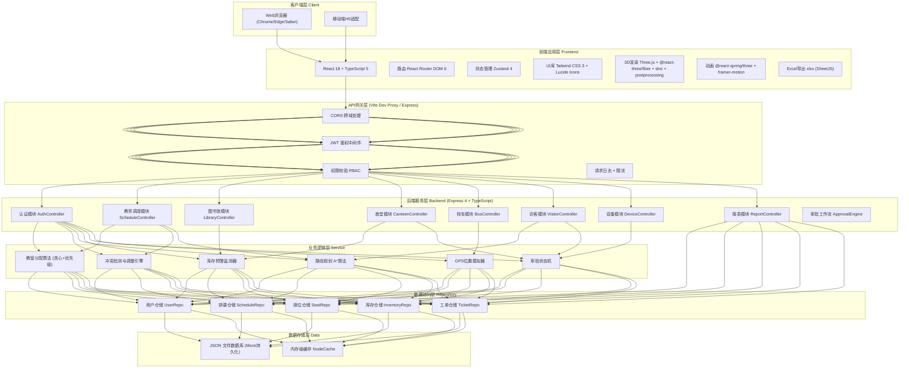
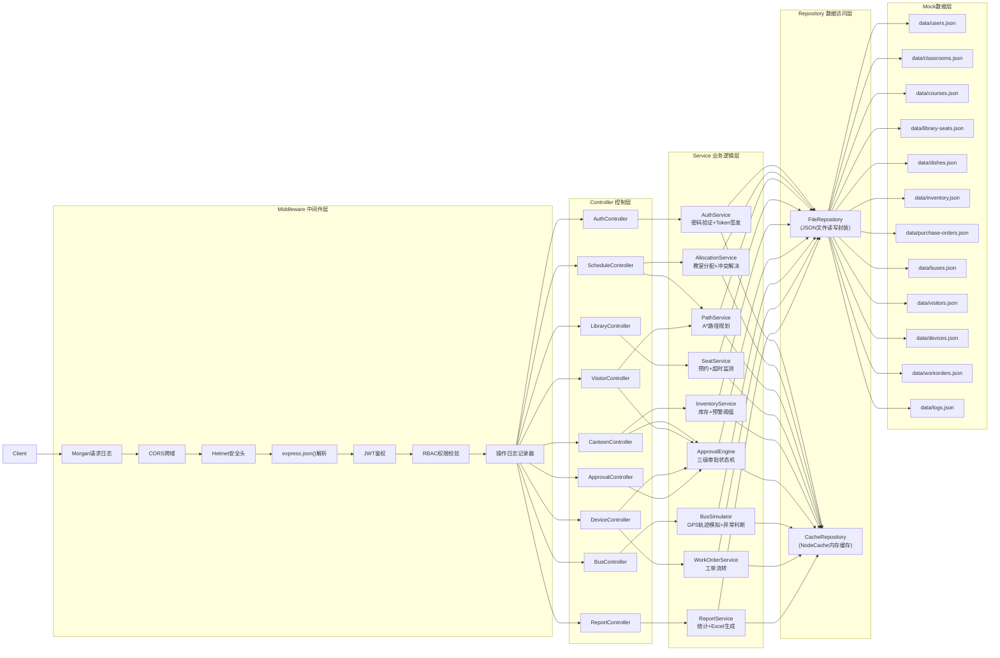
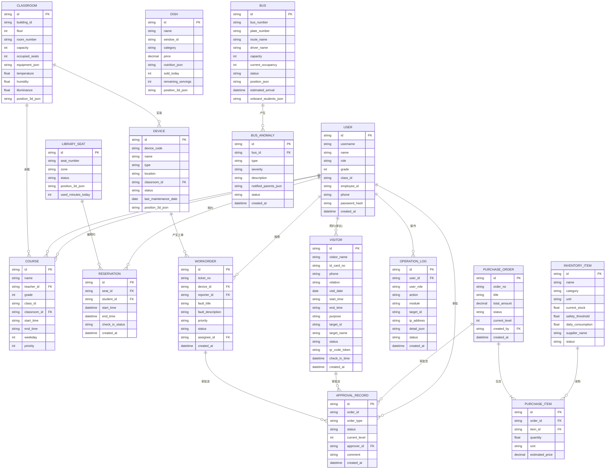

## 1. 架构设计



## 2. 技术说明

### 2.1 整体技术选型

| 层面 | 技术选择 | 版本 | 说明 |
|-----|---------|------|-----|
| 前端框架 | React | ^18.3.1 | 函数组件 + Hooks |
| 前端语言 | TypeScript | ^5.5.0 | 严格模式 strict: true |
| 构建工具 | Vite | ^5.3.0 | 极速HMR、Rollup打包 |
| 后端框架 | Express | ^4.19.2 | Node.js 标准Web框架 |
| 后端语言 | TypeScript + ESM | ^5.5.0 | ts-node 运行或 tsc 编译 |
| CSS框架 | Tailwind CSS | ^3.4.4 | 原子化CSS、主题定制 |
| 状态管理 | Zustand | ^4.5.2 | 轻量Flux、无Provider嵌套 |
| 路由 | react-router-dom | ^6.23.1 | 嵌套路由、懒加载 |
| 3D引擎 | three | ^0.165.0 | WebGL三维渲染 |
| React-3D | @react-three/fiber | ^8.16.0 | Three.js React封装 |
| 3D辅助库 | @react-three/drei | ^9.108.0 | 常用3D组件合集 |
| 3D后处理 | @react-three/postprocessing | ^2.16.2 | Bloom/SSAO/Outline |
| UI动画 | framer-motion | ^11.2.10 | DOM动画、手势 |
| 3D动画 | @react-spring/three | ^9.7.3 | Three.js物理动画 |
| 图标库 | lucide-react | ^0.395.0 | 线性现代图标 |
| Excel导出 | xlsx | ^0.18.5 | SheetJS社区版 |
| HTTP客户端 | axios | ^1.7.2 | 拦截器、取消请求 |
| 日期处理 | dayjs | ^1.11.11 | 轻量moment替代 |
| JWT | jsonwebtoken | ^9.0.2 | 无状态鉴权 |
| 密码加密 | bcryptjs | ^2.4.3 | 密码hash |
| 数据库 | JSON文件 + NodeCache | - | Mock数据持久化 |

### 2.2 初始化方案

使用模板：**react-express-ts**（React + Express 全栈TypeScript）

初始化命令：
```bash
# macOS/Linux
npm init vite-init@latest -y . -- --template react-express-ts --force
```

### 2.3 关键技术决策说明

1. **Three.js + R3F技术栈**：原生Three.js功能最全，R3F以React声明式方式管理3D场景，drei提供相机控制/阴影/GLTF加载器等开箱即用组件，postprocessing实现选中描边/辉光等视觉效果。
2. **JSON文件Mock数据库**：用户无需安装配置数据库，数据存入`data/*.json`文件，启动时加载至内存，修改后fs.writeFile持久化，适合演示环境。
3. **JWT+RBAC权限模型**：登录返回accessToken，每次请求携带Authorization头，后端中间件解析token后根据user.role匹配接口权限，未授权返回403。
4. **A*路径规划算法**：将校园网格化为2D栅格，楼栋/走廊为可行节点，墙体/障碍为不可行，起点终点用A*寻路，生成的路径点转Three.js TubeGeometry加流动纹理实现发光导航。
5. **教室分配贪心算法**：按年级优先级（高三=12 > 高二=11 > ... > 初一=7）排序课程，依次分配容量匹配+设备满足+时间空闲的最近教室，冲突时调整低优先级课程。
6. **审批有限状态机**：采购/访客/工单使用统一状态机 `DRAFT → PENDING_L1 → PENDING_L2 → PENDING_L3 → APPROVED → EXECUTED`，每级可REJECT回退至上一节点。

## 3. 路由定义

### 3.1 前端路由 (React Router)

| 路径 | 页面组件 | 权限要求 | 页面说明 |
|-----|---------|---------|---------|
| `/login` | LoginPage | 公开 | 人脸识别+账号密码登录页 |
| `/` | DashboardPage | 已登录 | 总控中心：3D校园全景+数据看板+告警 |
| `/teaching` | TeachingBuildingPage | 已登录 | 教学楼：3D楼层+教室管理+智能排课+路径指引 |
| `/library` | LibraryPage | 已登录 | 图书馆：3D座位布局+预约系统 |
| `/canteen` | CanteenPage | 已登录 | 食堂：3D餐台+菜品营养+库存+采购审批 |
| `/bus` | BusPage | 已登录 | 校车：实时位置+3D车辆+刷卡记录+异常 |
| `/visitor` | VisitorPage | 已登录 | 访客：预约+审批+3D路径 |
| `/device` | DevicePage | 已登录 | 设备：故障+工单看板+3D标注 |
| `/report` | ReportPage | 校长/主任 | 运营日报：数据统计+Excel导出 |
| `/logs` | OperationLogsPage | 校长/主任 | 操作日志查询 |
| `/approval` | ApprovalCenterPage | 审批角色 | 统一审批中心：我的待办+已办 |

### 3.2 后端API路由 (Express)

| Method | 路径 | Controller | 说明 |
|-------|-----|-----------|-----|
| POST | `/api/auth/login` | AuthController | 账号密码登录 |
| POST | `/api/auth/face-login` | AuthController | 人脸识别登录（模拟） |
| GET | `/api/auth/profile` | AuthController | 获取当前用户信息 |
| GET | `/api/users` | UserController | 用户列表（按角色筛选） |
| GET | `/api/classrooms` | ScheduleController | 教室列表+状态+环境 |
| GET | `/api/classrooms/:id` | ScheduleController | 教室详情（课表+传感器） |
| POST | `/api/schedule/allocate` | ScheduleController | 执行智能分配算法 |
| GET | `/api/schedule/timetable` | ScheduleController | 获取排课方案 |
| POST | `/api/schedule/resolve-conflict` | ScheduleController | 手动解决冲突 |
| GET | `/api/path/navigate` | ScheduleController | 路径规划（起点→终点） |
| GET | `/api/library/seats` | LibraryController | 座位状态列表 |
| POST | `/api/library/reserve` | LibraryController | 预约座位 |
| POST | `/api/library/checkin` | LibraryController | 签到确认 |
| GET | `/api/canteen/dishes` | CanteenController | 今日菜品+营养成分 |
| GET | `/api/canteen/inventory` | CanteenController | 食材库存 |
| GET | `/api/canteen/purchase-orders` | CanteenController | 采购申请单列表 |
| POST | `/api/canteen/purchase-orders` | CanteenController | 生成采购单（阈值触发） |
| GET | `/api/buses` | BusController | 校车列表+实时位置 |
| GET | `/api/buses/:id/track` | BusController | 单辆校车轨迹流(SSE) |
| POST | `/api/buses/scan` | BusController | 学生刷卡上车 |
| GET | `/api/buses/anomalies` | BusController | 异常事件列表 |
| GET | `/api/visitors` | VisitorController | 访客预约列表 |
| POST | `/api/visitors` | VisitorController | 提交访客预约 |
| GET | `/api/visitors/qrcode/:id` | VisitorController | 获取访客二维码 |
| GET | `/api/devices` | DeviceController | 设备台账 |
| GET | `/api/devices/tickets` | DeviceController | 维修工单列表 |
| POST | `/api/devices/report` | DeviceController | 报修+生成工单 |
| PUT | `/api/devices/tickets/:id/status` | DeviceController | 更新工单状态 |
| POST | `/api/approvals/:id/approve` | ApprovalEngine | 审批通过（按当前角色） |
| POST | `/api/approvals/:id/reject` | ApprovalEngine | 审批驳回 |
| GET | `/api/approvals/todo` | ApprovalEngine | 我的待审批列表 |
| GET | `/api/reports/daily` | ReportController | 获取日报数据 |
| GET | `/api/reports/daily/export` | ReportController | 导出日报Excel（返回二进制） |
| GET | `/api/logs` | OperationLogs | 操作日志查询 |
| POST | `/api/logs` | OperationLogs | 记录操作日志（中间件自动） |

## 4. API类型定义

```typescript
// ============ 共享类型 ============
export type UserRole =
  | 'student'
  | 'teacher'
  | 'head_teacher'
  | 'logistics_director'
  | 'moral_director'
  | 'principal'
  | 'parent';

export interface User {
  id: string;
  username: string;
  name: string;
  role: UserRole;
  avatar?: string;
  grade?: number;      // 学生：年级 7-12
  classId?: string;    // 班级ID
  employeeId?: string; // 教师工号
  phone?: string;
  createdAt: string;
}

export interface ApiResponse<T> {
  code: 0 | number;
  message: string;
  data: T;
  timestamp: number;
}

export interface PageResponse<T> {
  list: T[];
  total: number;
  page: number;
  pageSize: number;
}

export type ApprovalStatus =
  | 'DRAFT'
  | 'PENDING_L1'
  | 'PENDING_L2'
  | 'PENDING_L3'
  | 'APPROVED'
  | 'REJECTED'
  | 'EXECUTED'
  | 'CANCELLED';

export interface ApprovalRecord {
  id: string;
  orderId: string;
  orderType: 'PURCHASE' | 'VISITOR' | 'WORKORDER';
  status: ApprovalStatus;
  currentLevel: 1 | 2 | 3;
  approverId?: string;
  approverName?: string;
  comment?: string;
  createdAt: string;
  updatedAt: string;
}

// ============ 认证模块 ============
export interface LoginRequest {
  username: string;
  password: string;
  role?: UserRole;
}

export interface FaceLoginRequest {
  faceImageBase64: string;
}

export interface LoginResponse {
  token: string;
  user: User;
  permissions: string[];
}

// ============ 教室/排课模块 ============
export interface Classroom {
  id: string;
  buildingId: string;
  floor: number;
  roomNumber: string;
  capacity: number;
  occupiedSeats: number;
  equipment: ('projector' | 'blackboard' | 'computer' | 'lab' | 'music' | 'art')[];
  currentCourse?: Course;
  sensors: {
    temperature: number; // °C
    humidity: number;    // %
    illuminance: number; // lux
  };
  position3D: { x: number; y: number; z: number; floorHeight: number };
}

export interface Course {
  id: string;
  name: string;
  teacherId: string;
  teacherName: string;
  grade: number;        // 7-12
  classId: string;
  classroomId?: string;
  startTime: string;    // HH:mm
  endTime: string;      // HH:mm
  weekday: 1 | 2 | 3 | 4 | 5 | 6 | 7;
  requiredEquipment?: Classroom['equipment'];
  priority: number;     // 自动计算：年级越高越大
}

export interface ScheduleConflict {
  id: string;
  classroomId: string;
  classroomNumber: string;
  timeSlot: string;
  courses: {
    courseId: string;
    courseName: string;
    grade: number;
    className: string;
    teacherName: string;
    priority: number;
  }[];
  resolved: boolean;
  resolvedBy?: string;
}

export interface AllocationResult {
  totalCourses: number;
  allocatedCourses: number;
  conflicts: ScheduleConflict[];
  autoAdjusted: number;
  timetable: Course[];
}

export interface NavPath {
  from: string;   // 起点位置标识
  to: string;     // 终点位置标识
  waypoints: { x: number; y: number; z: number }[];
  distance: number;   // 米
  estimatedTime: number; // 分钟
}

// ============ 图书馆模块 ============
export type SeatStatus = 'AVAILABLE' | 'RESERVED' | 'IN_USE' | 'MAINTENANCE';

export interface LibrarySeat {
  id: string;
  seatNumber: string;
  zone: 'A安静区' | 'B讨论区' | 'C电子阅览区' | 'D靠窗区';
  status: SeatStatus;
  position3D: { x: number; y: number; z: number };
  currentStudentId?: string;
  currentStudentName?: string;
  reservedUntil?: string;
  checkedInAt?: string;
  usedMinutesToday: number;
}

export interface Reservation {
  id: string;
  seatId: string;
  seatNumber: string;
  studentId: string;
  studentName: string;
  startTime: string;
  endTime: string;
  checkInStatus: 'PENDING' | 'CHECKED_IN' | 'EXPIRED' | 'CANCELLED';
  createdAt: string;
}

// ============ 食堂模块 ============
export interface Nutrition {
  calories: number;     // 千卡
  protein: number;      // g
  fat: number;          // g
  carbohydrate: number; // g
  sodium?: number;      // mg
}

export interface Dish {
  id: string;
  name: string;
  windowId: string;
  windowName: string;
  category: '主食' | '热菜' | '凉菜' | '汤羹' | '小吃' | '饮品';
  price: number;
  nutrition: Nutrition;
  imageUrl?: string;
  ingredients: string[];
  allergens?: ('花生' | '海鲜' | '蛋奶' | '麸质' | '坚果')[];
  soldToday: number;
  remainingServings: number;
  position3D: { x: number; y: number; z: number };
}

export interface InventoryItem {
  id: string;
  name: string;
  category: '蔬菜' | '肉类' | '米面' | '调料' | '油料' | '冻品';
  unit: string;
  currentStock: number;
  safetyThreshold: number;
  dailyConsumption: number;
  lastPurchasedAt: string;
  supplierName: string;
  status: 'NORMAL' | 'WARNING' | 'CRITICAL';
}

export interface PurchaseOrder {
  id: string;
  orderNo: string;
  title: string;
  items: {
    itemId: string;
    itemName: string;
    quantity: number;
    unit: string;
    estimatedPrice: number;
  }[];
  totalAmount: number;
  status: ApprovalStatus;
  currentLevel: 1 | 2 | 3;
  createdBy: string;
  createdAt: string;
  approvals: {
    level: 1 | 2 | 3;
    approved: boolean;
    approverId?: string;
    approverName?: string;
    comment?: string;
    approvedAt?: string;
  }[];
}

// ============ 校车模块 ============
export interface Bus {
  id: string;
  busNumber: string;    // 如：校车01号
  plateNumber: string;  // 车牌号
  routeId: string;
  routeName: string;
  driverName: string;
  driverPhone: string;
  capacity: number;
  currentOccupancy: number;
  status: 'ON_ROUTE' | 'AT_STATION' | 'AT_SCHOOL' | 'MAINTENANCE' | 'DELAYED';
  currentPosition: {
    lat: number;
    lng: number;
    timestamp: string;
    speed: number;
    heading: number;
  };
  position3D: { x: number; y: number; z: number; rotationY: number };
  estimatedArrival: string;
  nextStation: string;
  onboardStudents: {
    studentId: string;
    studentName: string;
    grade: number;
    className: string;
    parentPhone: string;
    boardedAt: string;
    boardStation: string;
  }[];
}

export interface BusAnomaly {
  id: string;
  busId: string;
  busNumber: string;
  type: 'DELAY_OVER_15MIN' | 'STUDENT_MISSING' | 'ROUTE_DEVIATION' | 'ACCIDENT';
  severity: 'LOW' | 'MEDIUM' | 'HIGH' | 'CRITICAL';
  description: string;
  notifiedParents: { studentName: string; phone: string; notifiedAt: string }[];
  notifiedTeachers: { teacherName: string; phone: string; notifiedAt: string }[];
  status: 'PENDING' | 'HANDLING' | 'RESOLVED';
  resolvedAt?: string;
  resolutionNote?: string;
  createdAt: string;
}

// ============ 访客模块 ============
export interface Visitor {
  id: string;
  visitorName: string;
  idCardNo: string;
  phone: string;
  avatar?: string;
  relation: '父亲' | '母亲' | '爷爷' | '奶奶' | '外公' | '外婆' | '其他亲属' | '公务';
  visitDate: string;      // YYYY-MM-DD
  startTime: string;      // HH:mm
  endTime: string;        // HH:mm
  purpose: string;
  targetType: 'STUDENT' | 'TEACHER' | 'OFFICE';
  targetId: string;
  targetName: string;
  targetLocation?: string; // 目的地标识，用于3D路径
  headTeacherId?: string; // 班主任审批人
  status: ApprovalStatus;
  qrCodeToken?: string;
  checkInTime?: string;
  checkOutTime?: string;
  createdAt: string;
  path?: NavPath;
}

// ============ 设备模块 ============
export type DeviceType =
  | 'PROJECTOR'     // 投影仪
  | 'AIR_CONDITION' // 空调
  | 'COMPUTER'      // 电脑
  | 'LIGHT'         // 照明
  | 'BLACKBOARD'    // 黑板/智慧黑板
  | 'CCTV'          // 监控
  | 'ACCESS_DOOR'   // 门禁
  | 'FIRE_ALARM';   // 消防

export interface Device {
  id: string;
  deviceCode: string;
  name: string;
  type: DeviceType;
  location: string;       // 如：教学楼3楼301教室
  classroomId?: string;
  status: 'NORMAL' | 'WARNING' | 'FAULT' | 'MAINTENANCE';
  lastMaintenanceDate: string;
  nextMaintenanceDate: string;
  faultDescription?: string;
  faultTime?: string;
  position3D: { x: number; y: number; z: number; scene: 'teaching' | 'library' | 'canteen' | 'dormitory' };
}

export type TicketStatus = 'NEW' | 'ASSIGNED' | 'IN_PROGRESS' | 'PENDING_VERIFY' | 'COMPLETED' | 'CANCELLED';

export interface WorkOrder {
  id: string;
  ticketNo: string;
  deviceId: string;
  deviceName: string;
  deviceType: DeviceType;
  location: string;
  reporterId: string;
  reporterName: string;
  reporterPhone?: string;
  faultTitle: string;
  faultDescription: string;
  faultPhotos?: string[];
  priority: 'LOW' | 'MEDIUM' | 'HIGH' | 'CRITICAL';
  status: TicketStatus;
  assigneeId?: string;
  assigneeName?: string;
  createdAt: string;
  assignedAt?: string;
  startedAt?: string;
  completedAt?: string;
  repairNote?: string;
  repairCost?: number;
  rating?: 1 | 2 | 3 | 4 | 5;
}

// ============ 报表模块 ============
export interface DailyReport {
  reportDate: string;     // YYYY-MM-DD
  generatedAt: string;
  schoolName: string;
  attendance: {
    totalStudents: number;
    presentStudents: number;
    absentStudents: number;
    attendanceRate: number;
    byGrade: { grade: number; className: string; total: number; present: number; rate: number }[];
  };
  canteen: {
    totalMealsServed: number;
    totalRevenue: number;
    topDishes: { dishName: string; sold: number; revenue: number }[];
    consumption: { ingredientName: string; used: number; unit: string }[];
    lowStockAlerts: { itemName: string; current: number; threshold: number }[];
  };
  devices: {
    totalDevices: number;
    normalCount: number;
    faultCount: number;
    newTickets: number;
    completedTickets: number;
    avgRepairHours: number;
    byType: { type: DeviceType; total: number; fault: number }[];
  };
  events: {
    busAnomalies: number;
    visitorCount: number;
    emergencyCount: number;
    emergencyDetails: { type: string; time: string; description: string; status: string }[];
  };
}

// ============ 操作日志 ============
export interface OperationLog {
  id: string;
  userId: string;
  userName: string;
  userRole: UserRole;
  action: string;       // LOGIN / CREATE / UPDATE / DELETE / APPROVE / REJECT / EXPORT
  module: string;       // AUTH / SCHEDULE / LIBRARY / CANTEEN / BUS / VISITOR / DEVICE / REPORT
  targetId?: string;
  targetName?: string;
  ipAddress: string;
  userAgent?: string;
  detail?: string;      // JSON string
  status: 'SUCCESS' | 'FAILURE';
  createdAt: string;
}
```

## 5. 服务端架构图



## 6. 数据模型

### 6.1 ER关系图



### 6.2 初始化数据清单

初始化时生成以下Mock数据（每个JSON文件）：

| 数据文件 | 记录数 | 说明 |
|---------|-------|-----|
| users.json | 60+ | 4个年级×2个班=48学生 + 12教师 + 3主任 + 1校长 + 若干家长 |
| classrooms.json | 24 | 教学楼1-4楼各6间（含实验室/音乐/美术/计算机） |
| courses.json | 180 | 每年级每周30节课×6年级（含班级标识） |
| library-seats.json | 80 | 4个阅览区各20座 |
| dishes.json | 30 | 6窗口×5道菜 |
| inventory.json | 40 | 各类食材库存，20%处于低库存预警 |
| purchase-orders.json | 5-8 | 不同审批状态的采购单（含历史记录） |
| buses.json | 5 | 5条线路校车，含GPS模拟轨迹数据 |
| visitors.json | 10-15 | 含待审批/已通过/已签到访客 |
| devices.json | 120+ | 每教室5台设备（投影/空调/电脑/照明/门禁） |
| workorders.json | 8-12 | 各状态工单：新单/处理中/已完成 |
| logs.json | 200+ | 最近7天操作日志 |

### 6.3 定时任务/后台进程

后端启动时同步启动以下后台定时任务（setInterval）：

1. **传感器模拟器** (每10秒)：随机更新教室温湿度/照度数据
2. **校车GPS模拟器** (每3秒)：沿预设路径更新经纬度/位置
3. **超时检测器** (每30秒)：
   - 检查图书馆预约是否超15分钟未签到→释放座位
   - 检查校车预计到站超15分钟未到→触发异常+通知
4. **库存监控器** (每1分钟)：扫描库存低于阈值→自动创建采购单（DRAFT状态）
5. **座位使用统计** (每5分钟)：累计各座位今日使用时长
